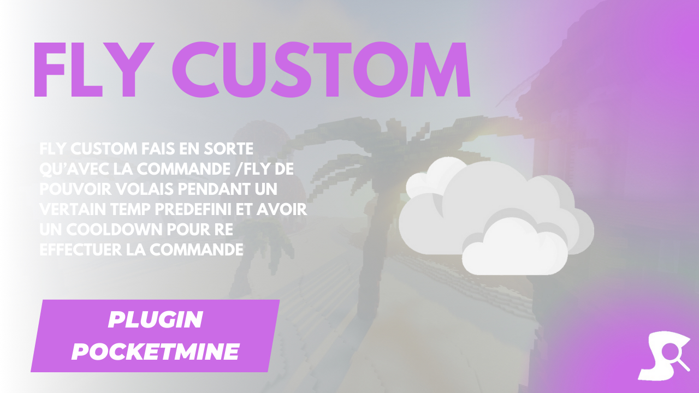

# [Fly](https://github.com/Synopsie/Fly) Plugin 🎐


## Features 🛠️

- **Command**: Use `/fly [player] [time]` to toggle flight.
- **Command**: Use `/flyspeed <speed> [player]` to change fly speed.
- **Configurable**: Various customization options.
- **Permissions**: Control command access.
- **Messages**: Inform players of actions.

## Configuration 📝

```yaml
# Config for Fly plugin

commands:
  fly:
    name: fly
    description: "Permet de voler"
    usage: /fly [player] [duration]
    permission:
      name: synopsie.fly.use
      default: operator #operator, user, console
    other:
      permission:
        name: synopsie.fly.other
        default: operator #operator, user, console
  flyspeed:
    name: flyspeed
    description: "Permet de changer la vitesse de vol"
    usage: /flyspeed <speed> [player]
    permission:
      name: synopsie.fly.speed
      default: operator #operator, user, console
    other:
      permission:
        name: synopsie.fly.speed.other
        default: operator #operator, user, console

use.command.ingame: "Veuilez utiliser cette commande en jeu"
no.clip.in.fly: false
fly.enabled: "Vous venez d'§aactiver §fle vole."
fly.disabled: "Vous venez de §cdésactiver §fle vole."
use.command.increative: "§cVous ne pouvez pas utiliser cette commande en créatif."
player.not.found: "§cLe joueur n'a pas été trouvé."
fly.enabled.by: "§e%staff% §fvient de vous §aactiver §fle vole."
fly.enabled.by.time: "§e%staff% §fvient de vous §aactiver §fle vole pour §e%time%§f."
fly.disabled.by: "§e%staff% §fvient de vous §cdésactiver §fle vole."
fly.enabled.to: "Vous venez de §aactiver §fle vole de §e%player%."
fly.enabled.to.time: "Vous venez de §aactiver §fle vole de §e%player% §fpour §e%time%§f."
fly.disabled.to: "Vous venez de §cdésactiver §fle vole de §e%player%."
flypseed.set: 'Vous avez défini votre vitesse de vole sur §e%speed%§f.'
flypseed.set.to: 'Vous avez défini la vitesse de vole de §e%player% §fsur §e%speed%§f.'
bossbar.title: "Fly mode: %time%"

#################
# Color:
# Red = rouge
# Blue = bleu
# Green = vert
# Yellow = jaune
# Purple = violet
# White = blanc
#################
bossbar.color: "red"
use.sound: true
```

